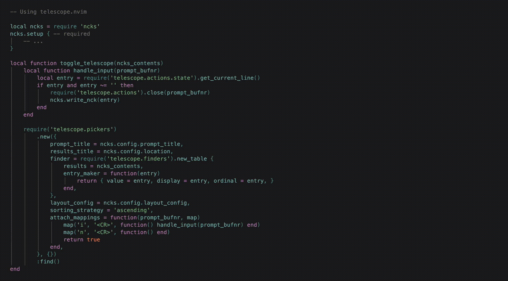

# ncks.nvim

Adding potential Discord nicknames to an endlessly expanding and rarely used text file... **WITHOUT LEAVING NEOVIM**!

This is my first [Neovim](https://github.com/neovim/neovim) plugin, and it's just a tiny little time saver utility I've been wanting for personal use, and I thought it'd be a simple starting point for learning plugin dev.



## Install

#### Requirements

- [Neovim](https://github.com/neovim/neovim) 0.7 or later
- [telescope.nvim](https://github.com/nvim-telescope/telescope.nvim) (optional, for the Telescope integration)

[lazy.nvim:](https://github.com/folke/lazy.nvim)

```lua
{
    "956MB/ncks.nvim",
    config = function()
        require("ncks").setup()

        vim.keymap.set('n', '<leader>nn', function() ncks.new() end, { desc = "Add [N]ew [N]ickname" })
        vim.keymap.set('n', '<leader>no', function() ncks.open() end, { desc = "[O]pen [N]cks file" })
        vim.keymap.set('n', '<leader>nl', function() ncks.list() end, { desc = "[L]ist [N]cks file" })
        vim.keymap.set('n', '<leader>nr', function() ncks.random() end, { desc = "Pick [R]andom [N]ickname from file" })
        vim.keymap.set('n', '<leader>ni', function() ncks.info() end, { desc = "Show [N]cks file [I]nfo" })
    end
}
```

## Commands

- `:NcksNew` {optional_pass}
    - Adds new name entry to your ncks file, by default opens dialog.
    - `{optional_pass}` pass new entry to file inline, instead of opening the dialog.
- `:NcksOpen`
    - Opens ncks file in new buffer.
- `:NcksList`
    - Returns all lines of ncks file in list.
- `:NcksRandom`
    - Picks random entry from ncks file, copies it to clipboard.
- `:NcksInfo`
    - Displays various information on ncks file, like ***file location*** and ***entry count***.

## Configuration

### Defaults

```lua
┌─ New (~/.ncks) ───────────────────────┐
│ ...                                 * │ -- Without preview (Default)
└───────────────────────────────────────┘

-- ...

{
    -- Default file ~/.ncks, but can use literally anything
    location = vim.fn.expand '~/.ncks',
    -- Layout config stuff if you want Telescope
    layout_config = {
        prompt_position = 'top',
        width = 0.50,
        height = 0.20,
    },
    prompt_title = 'New',
}
```

### Telescope

```lua
┌───────────────── New ─────────────────┐
│ ...                           12 / 12 │
├─────────────── ~/.ncks ───────────────┤
│ BATT_MODEL_RAW                        │
│ conductor galloping spans             │
│ L812 Electric Two-Sided Grill         │ -- With preview (Telescope)
│ lackof(grid)                          │
│ ...                                   │
└───────────────────────────────────────┘

-- ...

{   -- Using telescope.nvim

    local ncks = require 'ncks'
    ncks.setup { -- required
        -- ...
    }

    local function toggle_telescope(ncks_contents)
        local function handle_input(prompt_bufnr)
            local entry = require('telescope.actions.state').get_current_line()
            if entry and entry ~= '' then
                require('telescope.actions').close(prompt_bufnr)
                ncks.write_nck(entry)
            end
        end

        require('telescope.pickers')
            .new({
                prompt_title = ncks.config.prompt_title,
                results_title = ncks.config.location,
                finder = require('telescope.finders').new_table {
                    results = ncks_contents,
                    entry_maker = function(entry)
                        return { value = entry, display = entry, ordinal = entry, }
                    end,
                },
                layout_config = ncks.config.layout_config,
                sorting_strategy = 'ascending',
                attach_mappings = function(prompt_bufnr, map)
                    map('i', '<CR>', function() handle_input(prompt_bufnr) end)
                    map('n', '<CR>', function() end)
                    return true
                end,
            }, {})
            :find()
    end

    -- ... keymaps

    vim.keymap.set('n', '<leader>nn', function()
        toggle_telescope(ncks.list())
    end, { desc = 'Open ncks window' })
}
```

## Aknowledgements

Both [`ThePrimeagen/harpoon`](https://github.com/ThePrimeagen/harpoon/tree/harpoon2) and [`tamton-aquib/stuff.nvim`](https://github.com/tamton-aquib/stuff.nvim) served as inspiration and helped me build up the structure of this tiny plugin. (The Telescope thing is straight out of harpoon TBH)

## TODO

- [ ] I've only run this on macOS, but I don't see why it wouldn't work on Linux or Windows
- [ ] Still confused on how to fine tune all of Telescope settings
    - [ ] Line count in the prompt shouldn't be "9 / 9"
    - [ ] Results window really has no reason to be scrollable, unless the lines are an editable buffer like [oil.nvim](https://github.com/stevearc/oil.nvim)
    - [ ] Figure out how to use Telescope ui without the results window, just the prompt
    - [ ] Line numbers in Telescope results
- [ ] More commands... don't even know what I want yet, tbd
- [ ] Multiple lists?
- [ ] Tests?

## License

[MIT license](./LICENSE)

