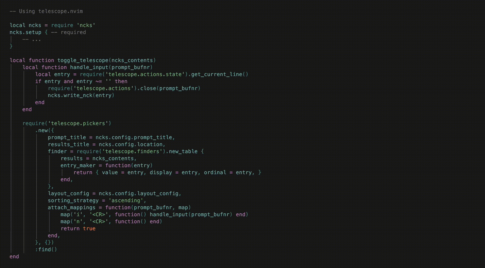

# ncks.nvim

Adding random Discord nicknames to an endlessly expanding and rarely used text file... **WITHOUT LEAVING NEOVIM**!

This is my first [Neovim](https://github.com/neovim/neovim) plugin, and it's just a tiny little time saver utility I've been wanting for personal use, and I thought it'd be a simple starting point for learning plugin dev.



## Install

#### Requirements

- [Neovim](https://github.com/neovim/neovim) 0.7 or later
- [telescope.nvim](https://github.com/nvim-telescope/telescope.nvim) (optional, for the Telescope integration)

[lazy.nvim:](https://github.com/folke/lazy.nvim)

```lua
{
    "956MB/ncks.nvim",
    dependencies = {
        "nvim-telescope/telescope.nvim",
    },
    config = function()
        require('ncks').setup {} -- required

        vim.keymap.set('n', '<leader>nn', '<cmd>NcksNew<cr>', { desc = 'Add [N]ew [N]ickname' })
        vim.keymap.set('n', '<leader>ni', '<cmd>NcksInfo<cr>', { desc = 'Show [N]cks file [I]nfo' })
        vim.keymap.set('n', '<leader>ns', '<cmd>NcksSearch<cr>', { desc = 'Search [N]cks file' })
        vim.keymap.set('n', '<leader>no', '<cmd>NcksOpen<cr>', { desc = '[O]pen [N]cks file' })
        vim.keymap.set('n', '<leader>nl', '<cmd>NcksList<cr>', { desc = '[L]ist [N]cks files' })
        vim.keymap.set('n', '<leader>nc', '<cmd>NcksCopyAll<cr>', { desc = '[C]opy all [N]icknames from file to clipboard' })
        vim.keymap.set('n', '<leader>nr', '<cmd>NcksRandom<cr>', { desc = 'Pick [R]andom [N]ick from file' })
    end
}
```

## Commands

- `:NcksInfo`
    - Displays various information on ncks file, like ***file location*** and ***entry count***.
- `:NcksSearch`
    - Search nicknames and copy selection to clipboard
- `:NcksOpen`
    - Opens ncks file in new buffer.
- `:NcksCopyAll`
    - Copies all entries from ncks file to clipboard.
- `:NcksRandom`
    - Picks random entry from ncks file, copies it to clipboard.
- `:NcksList`
    - Returns all lines of ncks file in list.
- `:NcksNew` {optional_pass}
    - Adds new name entry to your ncks file, by default opens dialog.
    - `{optional_pass}` pass new entry to file inline, instead of opening the dialog.

## Configuration

```lua
{
    -- Default file ~/.ncks, but can use literally anything
    location = '~/.ncks',
    -- Telescope layout configuration
    layout_config = {
        prompt_position = 'top',
        width = 0.50,
        height = 0.20,
    },
    -- Default settings
    telescope_defaults = {
        include_location = true, -- Include file location in prompt title
        selection_caret = '┃ ',
    },
    new_nickname = {
        prompt_title = 'New Nickname',
        prompt_prefix = '   ', -- Plus icon for adding new nickname
    },
    search = {
        prompt_title = 'Search Nicknames',
        prompt_prefix = '   ', -- Search icon for searching nicknames
    },
}
```

## Aknowledgements

Both [`ThePrimeagen/harpoon`](https://github.com/ThePrimeagen/harpoon/tree/harpoon2) and [`tamton-aquib/stuff.nvim`](https://github.com/tamton-aquib/stuff.nvim) served as inspiration and helped me build up the structure of this tiny plugin.

## TODO

- [ ] Multiple lists?
- [ ] More commands (delete, edit, etc):

## License

[MIT license](./LICENSE)

